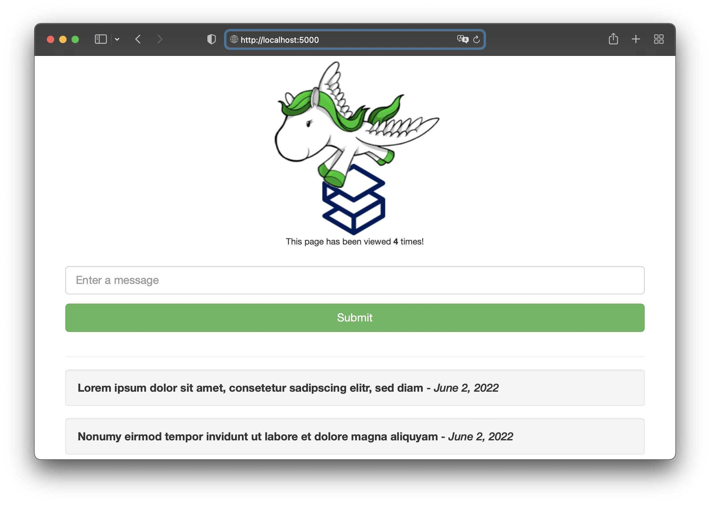

# sample-app-django

A sample app for [SetOps](https://setops.co) built with [Python Django](https://www.djangoproject.com/).

The app is [deployed on SetOps](https://web.django.samples.zweitagapps.net) with GitHub Actions from this repository: [check out the deployment workflow](.github/workflows/deploy.yml)!

If you want to deploy the app yourself, use the image referenced below. Apps created from a SetOps stage template use this image, too.

```
docker pull ghcr.io/setopsco/sample-app-django:latest
```



## What to try

1. Deploy the app as a sample app from the [SetOps Web UI](https://app.setops.co). You can select it from the list of sample apps when you create a stage.

1. Wait until the stage is created and the progress bar disappears. Click on the stage and select the *web* app.

1. Make yourself comfortable with the app status dashboard and the information it tells you about the current state of your app.

1. Visit the app by clicking on `Visit Website`.

1. Create new entries to the mini blog.

## Components

* **App:** There is only a single app called **web** required that contains the django app that is served by a gunicorn server.

* **Services:** The service **database** runs a postgres instance that stores the posts that are performed in the app.

## Creating the app from scratch

> **Note**
> These are the steps you need to follow to manually create the app in SetOps. You can use a stage template on the web UI to do this in a single step.

1. Create the stage: 

   ```
   setops -p samples stage:create django
   ```

1. Create the app: 

   ```
   setops -p samples -s django app:create web
   ```

1. Configure the app:

   ```
   setops -p samples -s django --app web container:set command -- /bin/bash -c "python manage.py makemigrations todo && python manage.py migrate && gunicorn docker_django.wsgi:application -w 2 -b :5000"
   setops -p samples -s django --app web network:set health-check-path /health/
   setops -p samples -s django --app web network:set public true
   setops -p samples -s django --app web network:set port 5000
   setops -p samples -s django --app web resource:set cpu 128
   setops -p samples -s django --app web resource:set memory 256
   ```

1. Set ENVs:

   ```
   setops -p samples -s django --app web env:set SECRET_KEY=YOUR-SECRET-KEY --description "Secret Key to encrypt and sign data"
   ```

1. Create the database:

   ```
   setops -p samples -s django service:create database --type postgresql11 --plan shared
   ```

1. Link the database to your app:

   ```
   setops -p samples -s django --app web link:create database --env-key DATABASE_URL
   ```

1. Commit your changes

   ```
   setops -p samples -s django changeset:commit
   ```

1. Push the Docker image and activate the release:

   ```
   docker pull ghcr.io/setopsco/sample-app-django:latest
   docker tag ghcr.io/setopsco/sample-app-django api.setops.co/demo/samples/django/web:latest
   docker push api.setops.co/demo/samples/django/web:latest
   # note the sha256:[...] digest after pushing the image and paste it in "release:create"
   setops -p samples -s django --app web release:create sha256:3899c519fe3d4ac08ef24bcca1ae7c1c5474f0448f474811f1c3cbda7229a0e4
   setops -p samples -s django --app web release:activate 1
   setops -p samples -s django changeset:commit
   ```

1. Open your app! :tada:
